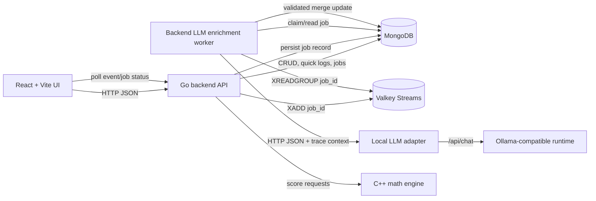
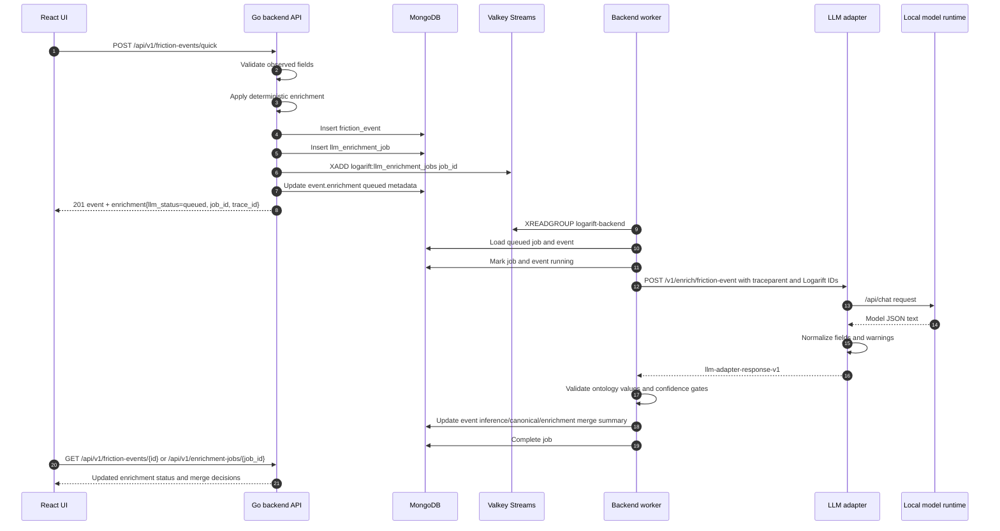
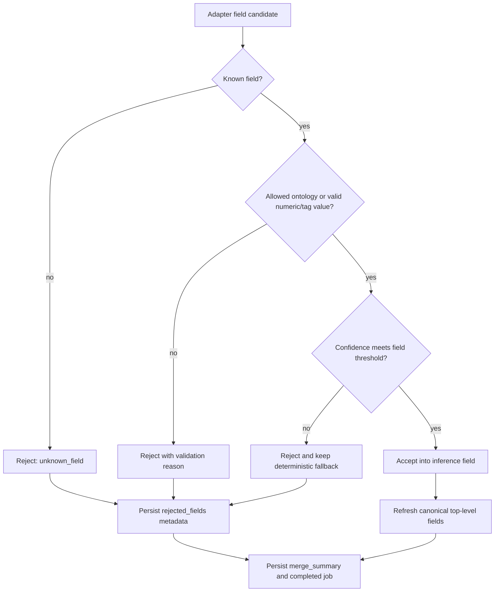
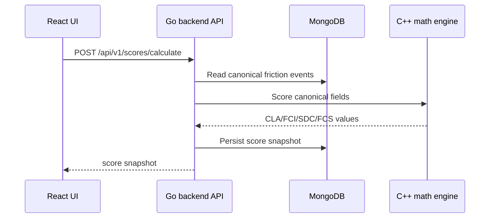

# Logarift System Design

## Purpose

This living document describes how Logarift components integrate at runtime. It replaces the one-off asynchronous LLM enrichment design note and should be updated whenever component boundaries, data contracts, or integration mechanisms change.

Logarift remains local-first: the UI, backend API, MongoDB, math engine, LLM adapter, model runtime, logs, traces, and tests run locally by default.

## Component map



## Quick logging and asynchronous LLM enrichment

Quick logging saves first and enriches second. The synchronous API request never depends on local model latency.



## Runtime contracts

### Quick-create response

`POST /api/v1/friction-events/quick` returns:

```json
{
  "event": {},
  "enrichment": {
    "llm_status": "queued",
    "job_id": "64f000000000000000000001",
    "trace_id": "4bf92f3577b34da6a3ce929d0e0e4736",
    "deterministic_status": "applied",
    "user_message": "Saved. Local LLM enrichment is running."
  }
}
```

When the adapter is disabled, `llm_status` is `disabled` and deterministic fields are final. When enqueue fails after event persistence, `llm_status` is `not_queued` and the event remains saved.

### Job status endpoint

`GET /api/v1/enrichment-jobs/{id}` returns the durable LLM job document. The UI can poll this endpoint or the event endpoint. Supported status values are:

```text
not_requested
queued
running
succeeded
partially_succeeded
failed
timed_out
cancelled
disabled
not_queued
```

### Adapter request path

The backend persists every job in MongoDB and uses Valkey Streams for asynchronous dispatch. Compose pins the open-source `valkey/valkey:9.1.0-alpine` image, creates the `logarift:llm_enrichment_jobs` stream with consumer group `logarift-backend`, publishes jobs with `XADD`, consumes them with `XREADGROUP GROUP`, and acknowledges processed messages with `XACK`. MongoDB remains the auditable job state source; Valkey is the delivery mechanism.

The backend worker calls:

```text
POST /v1/enrich/friction-event
```

It propagates:

```text
traceparent
tracestate
baggage
x-logarift-request-id
x-logarift-event-id
x-logarift-job-id
```

The adapter does not expose browser-facing endpoints and does not write to MongoDB. The backend owns validation, merge decisions, persistence, and UI-facing status.

## Merge and persistence model

The backend merges adapter output field-by-field. A syntactically valid adapter response with zero candidate fields is not treated as a transport or adapter failure; the backend records `partially_succeeded`, keeps deterministic canonical fields, and stores a merge decision with `reason=no_fields_returned` so the UI does not show a false hard failure:



The event stores:

- `observed`: user-entered timestamp, friction level, notes, links, and attachments
- `inference`: deterministic and accepted/rejected LLM field metadata
- `canonical`: backend-validated fields used by analytics and scoring
- `enrichment`: UI-facing status, job ID, trace ID, and merge summary

The job stores status, attempts, adapter/model metadata, warning count, error code, and the same merge summary for operational inspection.

## Observability model

The first implementation uses OpenTelemetry-compatible identifiers and structured JSON logs that remain local through STDOUT/STDERR. A collector can be added later without changing domain contracts.

Important correlation fields:

```text
trace_id
request_id
event_id
job_id
adapter_version
model_runtime
model_name
prompt_version
llm_status
normalized_field_count (adapter logs)
accepted_field_count (backend merge policy)
rejected_field_count
fallback_field_count
warning_count
error_code
```

Important log events:

```text
llm adapter output normalized
llm enrichment merge completed
llm enrichment job failed
request completed
```

Raw prompts, raw notes, screenshot contents, private URLs, environment variables, and raw model responses are not logged by default. Adapter field values, confidence scores, warning codes, and backend decision reasons are logged because they are required to debug local enrichment conversion.

## Scoring flow



The math engine only consumes backend-canonical fields. It does not call the LLM adapter and does not interpret raw notes.

## Local Docker Compose testing

The integration test project under `tests/integration` starts Docker Compose with the adapter mock response mode enabled. This verifies the complete async contract without requiring a local Ollama model download:

```text
LOGARIFT_LLM_ADAPTER_ENABLED=true
LOGARIFT_LLM_MOCK_RESPONSE_ENABLED=true
```

Production-like local runs should leave `LOGARIFT_LLM_MOCK_RESPONSE_ENABLED=false` and point the adapter at an Ollama-compatible runtime. If the adapter logs `normalized_field_count=0`, first inspect the `warnings` value and merge summary; this usually indicates prompt/response-shape conservatism or rejected schema output, not necessarily that the model is too small. The prompt and Modelfiles instruct local models to confirm safe deterministic baselines for simple notes before returning an empty `fields` object.
